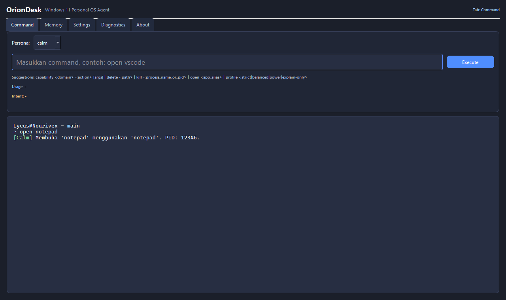
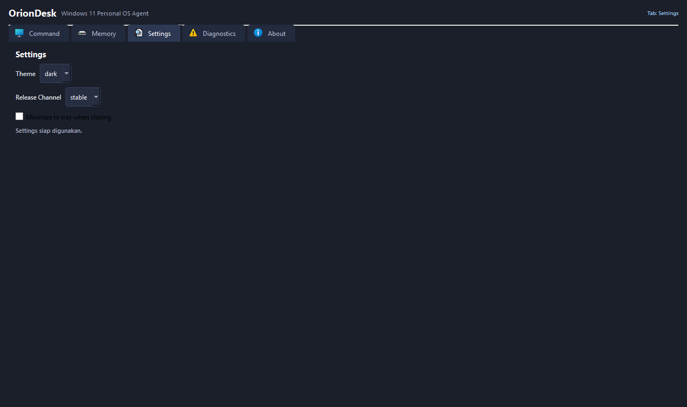
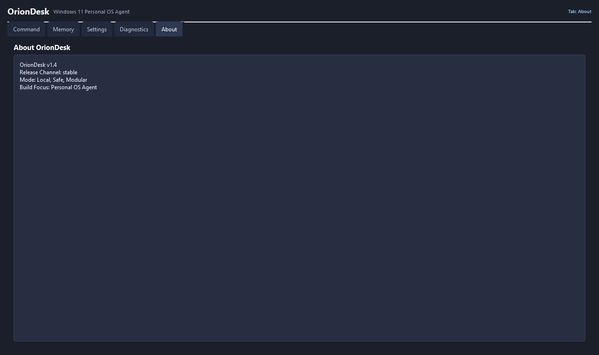
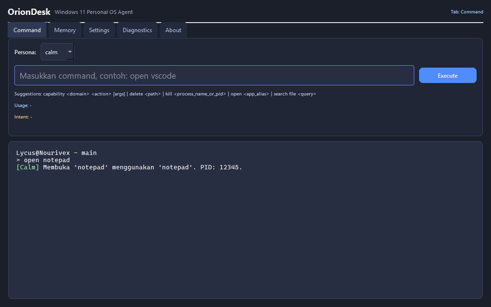
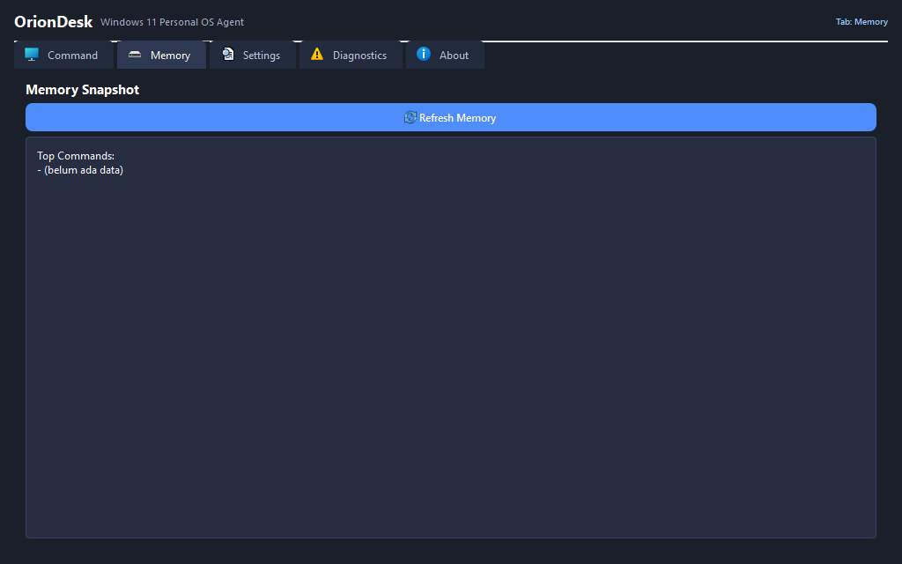
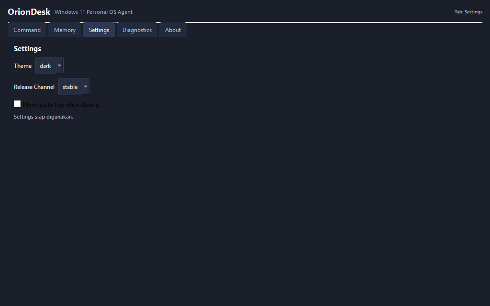
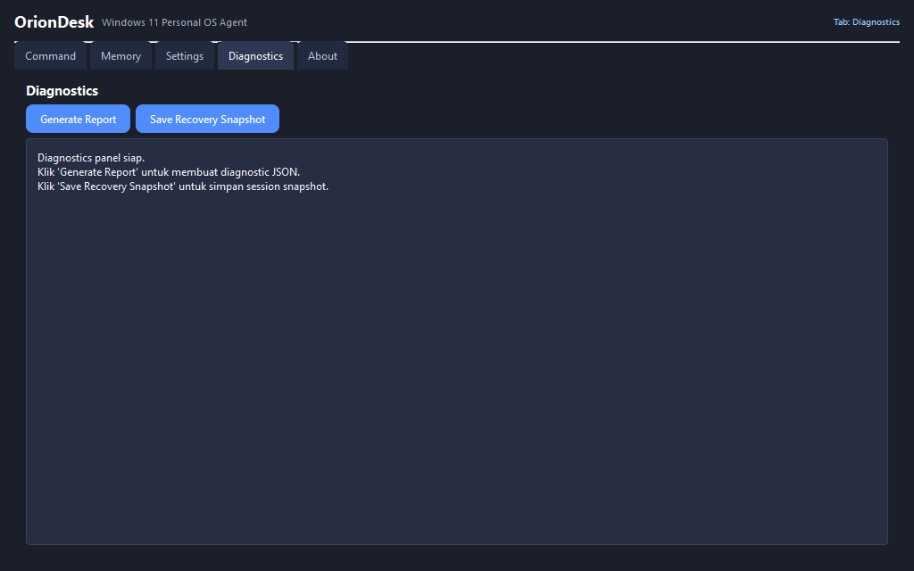
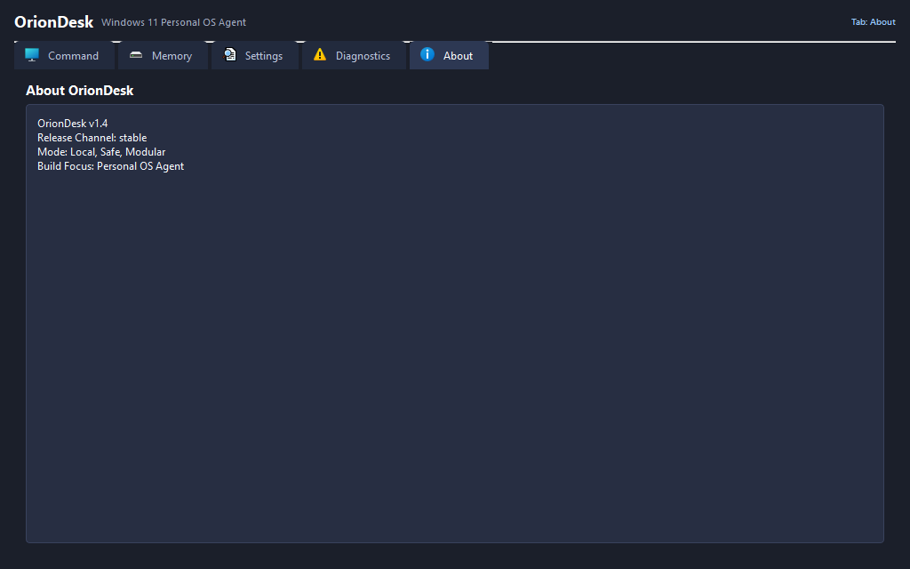

# OrionDesk Wireframe (v5)

Dokumen ini menjadi referensi wireframe visual untuk UI OrionDesk versi roadmap aktif terbaru.

## Struktur Tab Utama

- Command
- Memory
- Settings
- Diagnostics
- About

## Baseline Snapshot v5

### 1280 x 760

### 1024 x 640

## Catatan

- Snapshot dihasilkan dari test visual regression.
- Jika layout berubah, baseline v5 harus direfresh via test snapshot.
