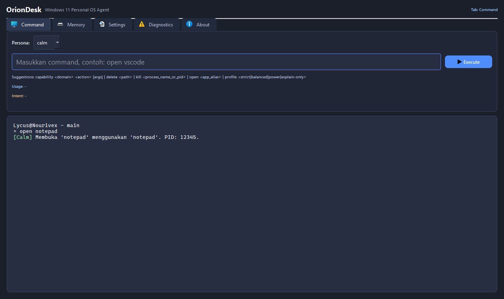
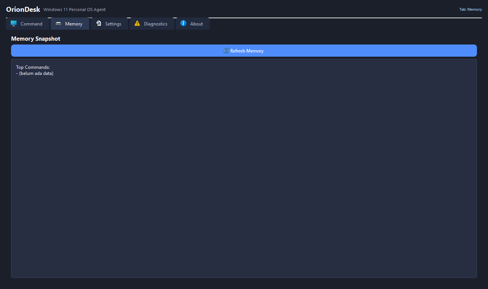
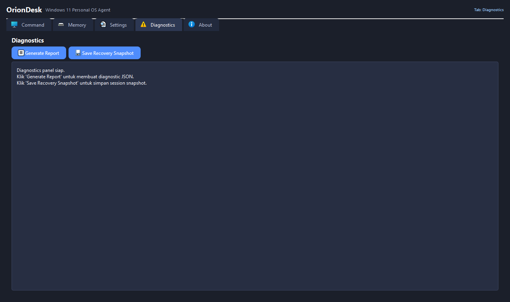
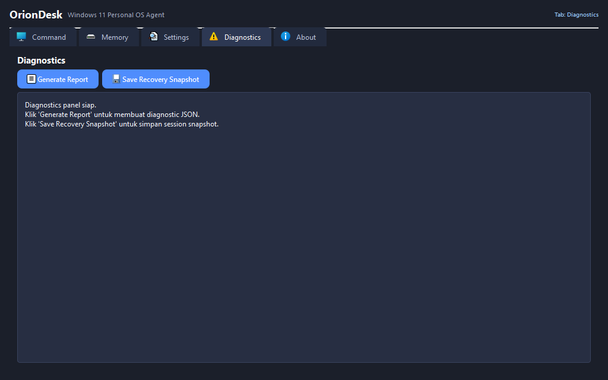

# 🖼 OrionDesk Wireframe (v5)

Dokumen ini menjadi referensi visual resmi untuk baseline UI OrionDesk pada roadmap aktif.

Snapshot digunakan untuk:
- Validasi konsistensi layout
- Visual regression testing
- Dokumentasi evolusi antarmuka

---

## 🧭 Main Navigation Tabs

OrionDesk saat ini terdiri dari lima tab utama:

- **Command**
- **Memory**
- **Settings**
- **Diagnostics**
- **About**

Struktur tab ini menjadi baseline navigasi untuk versi v5.

---

## 📐 Baseline Snapshot – Desktop Layout

### 1280 × 760

| Tab | Preview |
|-----|---------|
| Command |  |
| Memory |  |
| Settings |  |
| Diagnostics |  |
| About |  |

---

### 1024 × 640

| Tab | Preview |
|-----|---------|
| Command |  |
| Memory |  |
| Settings |  |
| Diagnostics |  |
| About |  |

---

## 🧪 Snapshot Governance

- Snapshot dihasilkan melalui automated visual regression test.
- Perubahan layout signifikan **wajib** diikuti refresh baseline.
- Perubahan minor harus dievaluasi melalui PR review.

---

## 🔄 Versioning Policy

- `v5` → Stabil baseline untuk ROADMAP v5.
- Versi berikutnya akan memiliki folder snapshot terpisah (`v6/`, `v7/`, dst).
